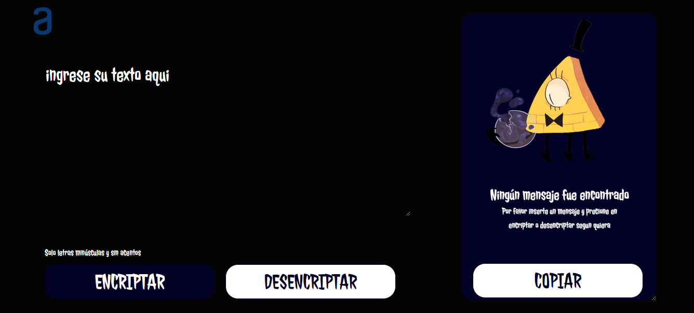
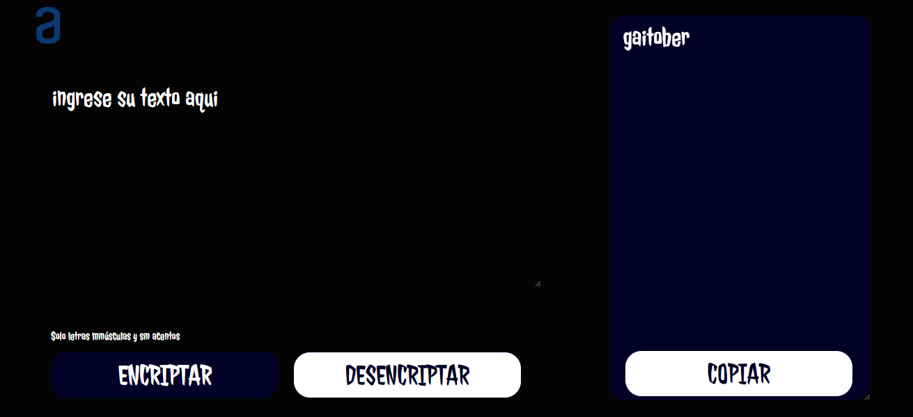
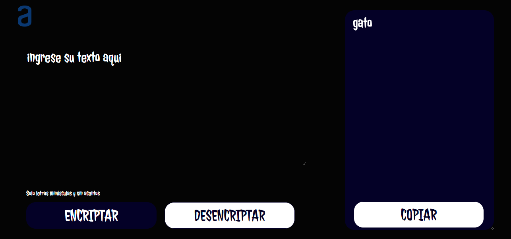
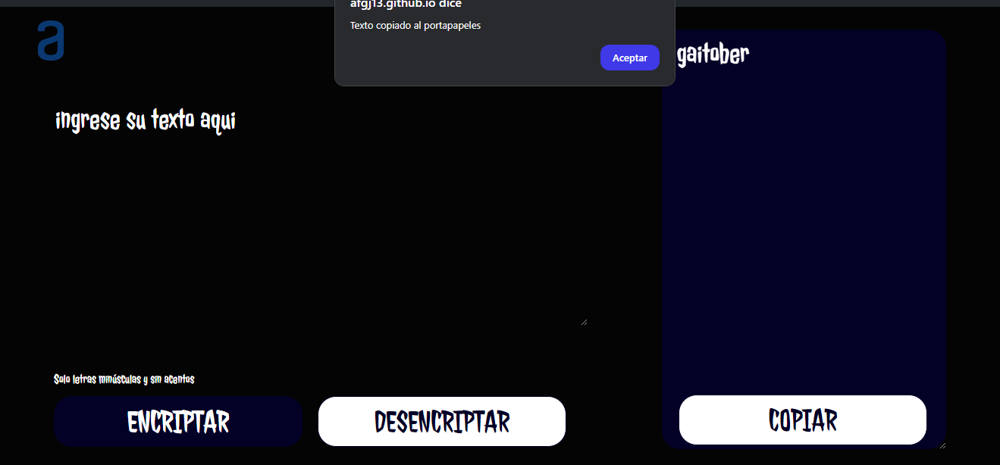
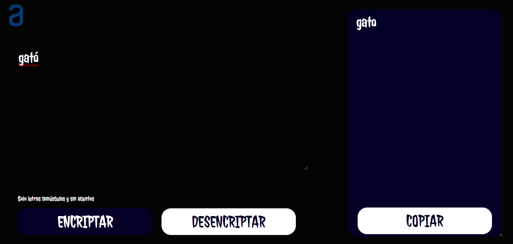
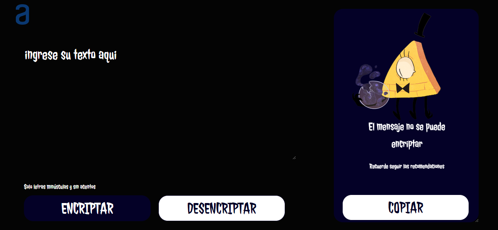
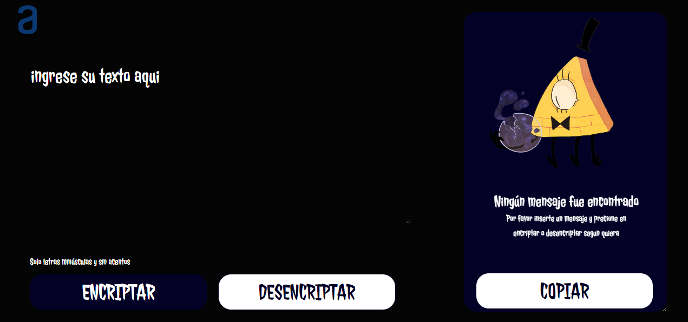

# Nota
En este proyecto prioricé las capacidades del sistema al diseño, por lo que hay un gran margen de mejora en aspectos de UI/UX.

# DESAFÍO ENCRIPTADOR DE TEXTO

Desarrollé una página web que encripta textos, con el fin de intercambiar mensajes secretos con otras personas que sepan el secreto de la encriptación utilizada.

Las "llaves" de encriptación que se utilizaron son las siguientes:

- La letra "e" es convertida para "enter"
- La letra "i" es convertida para "imes"
- La letra "a" es convertida para "ai"
- La letra "o" es convertida para "ober"
- La letra "u" es convertida para "ufat"

### Requisitos:

- Debe funcionar solo con letras minúsculas.
- No deben ser utilizadas letras con acentos ni caracteres especiales.
- Debe ser posible convertir una palabra para la versión encriptada y también devolver una palabra encriptada a su versión original.

Por ejemplo:
- "gato" => "gaitober"
- "gaitober" => "gato"

La página debe tener campos para:
- Inserción del texto que será encriptado o desencriptado, y el usuario debe poder escoger entre las dos opciones.
- El resultado debe ser mostrado en la pantalla.

### Características Especiales:
Aparte de los requerimientos previamente establecidos, decidí agregar ciertas características que mejoran el funcionamiento del programa como:

- Un botón que copia al portapapeles el texto obtenido.
- Una ventana emergente que avisa cuando se copia correctamente el texto.
- Un mensaje especial para cuando no se ha insertado ningún texto.
- Un mensaje especial para cuando se inserta un texto que no cumple con los requisitos establecidos.

## Tecnologías Utilizadas:
- **HTML**
- **CSS**
- **JavaScript**

## Funcionamiento del Desafío:
1. El usuario ingresa el texto en el área designada.
2. Elige entre encriptar o desencriptar el texto.
3. El resultado se muestra en la pantalla.
4. El usuario puede copiar el resultado al portapapeles con un solo clic.
5. Si el texto ingresado no cumple con los requisitos, se muestran mensajes de advertencia.

## Capturas del Proyecto:

### Pantalla Inicio

### Funcionamiento Encriptar

### Funcionamiento Desencriptar

### Funcionamiento Copiar

### Funcionamiento Filtro de Caracteres

### Funcionamiento Mensaje de Inicio

---

Este proyecto fue realizado por **Andrés Felipe Galvis Jiménez**.
